# Otaku Flow

A modern Flutter manga reader app built with clean architecture, BLoC state management, localization, theming, favorites, continue reading, and a premium reader experience powered by MangaDex API.

---

## ✨ Features

- 📚 Browse manga collections:
  - Trending
  - Latest
  - Popular
- 🔎 Search manga
- 📖 Manga detail page with summary + paginated chapter list
- 📄 Reader screen with:
  - Vertical reading
  - Pinch zoom
  - Double tap zoom
  - Next / Previous chapter navigation
- ❤️ Favorites system (local persistence)
- ⏯ Continue Reading system
- 🌍 Multi-language support:
  - English
  - Vietnamese
  - Japanese
  - Thai
- 🌙 Dark mode / Light mode
- ⚙ Settings screen
- 🚀 Dev / Prod flavor support
- 🧪 Widget tests + CI ready structure

---

## 🧱 Tech Stack

- Flutter
- Dart
- flutter_bloc
- go_router
- get_it
- dio
- shared_preferences
- cached_network_image
- connectivity_plus
- flutter_gen / intl

---

## 🏗 Architecture

Clean Architecture structure:

```text
lib/
├── app/
├── core/
├── features/
│   ├── home/
│   ├── search/
│   ├── manga_detail/
│   ├── reader/
│   ├── favorites/
│   ├── reader_progress/
│   └── settings/
```

Layers:

- Presentation
- Domain
- Data

---

## 📱 Screenshots

### Onboarding

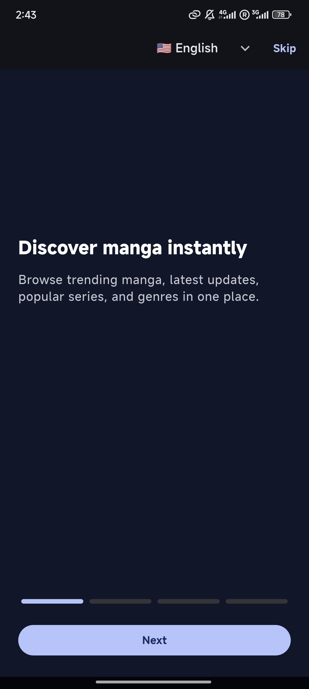

### Onboarding Change Language


### First Load Main

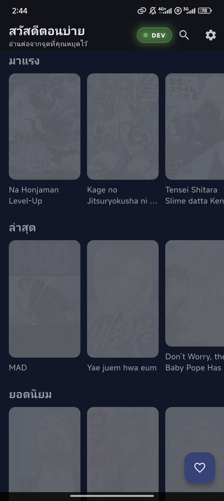

### Main Screen


### Settings

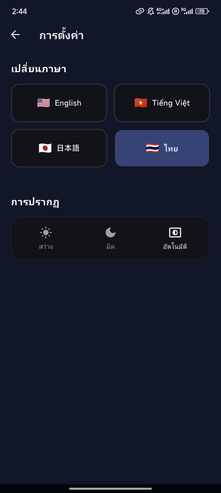

### Change Language Settings

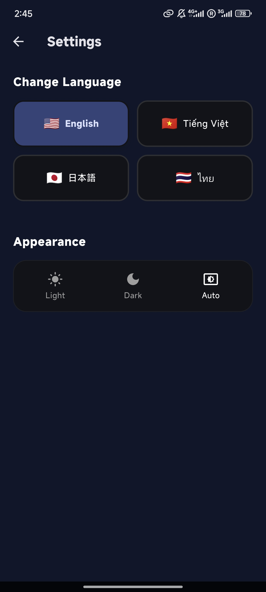

### Language Effect Whole App Immediately

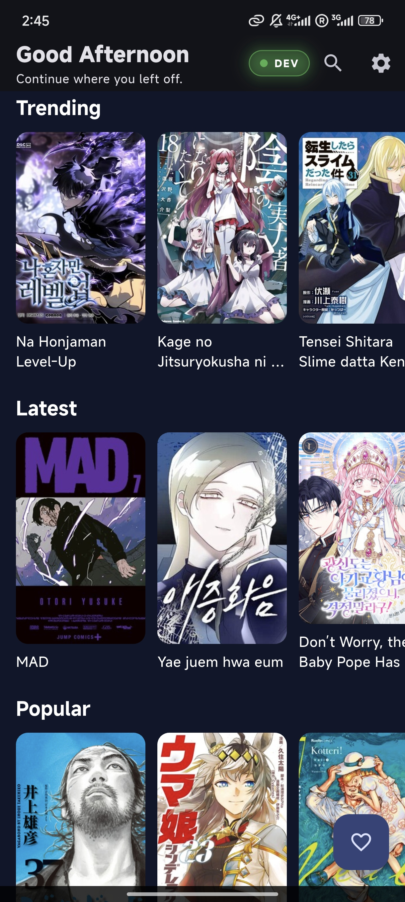

### Search

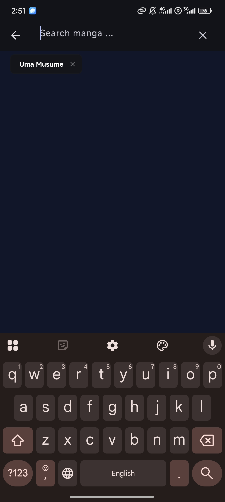

### Search Loading

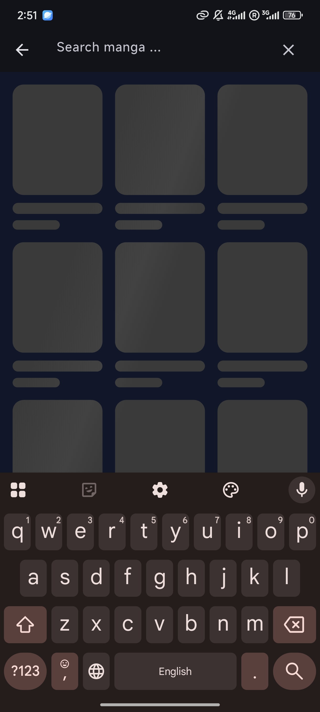

### Search Result

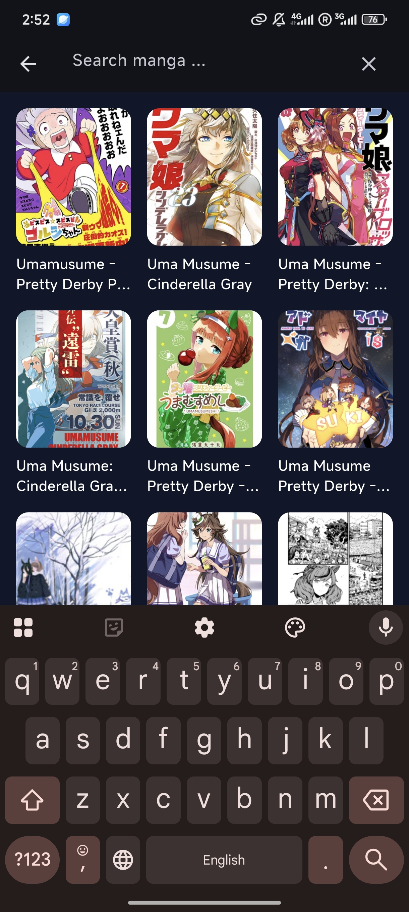

### Detail

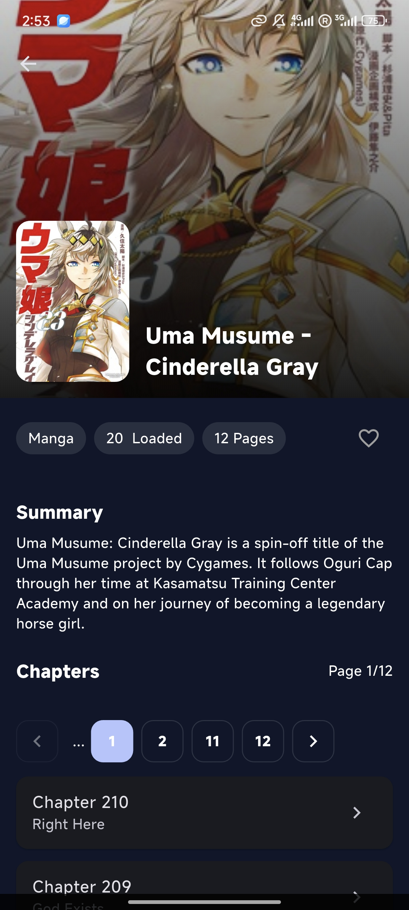

### Detail Sliver

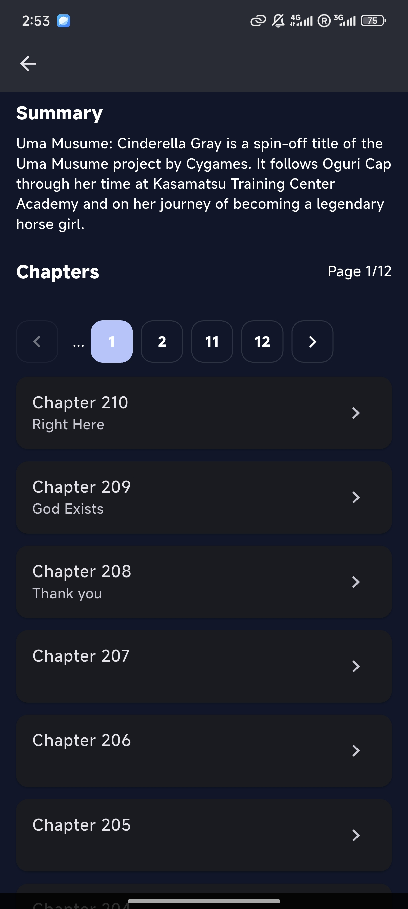

### Skeleton Page Change

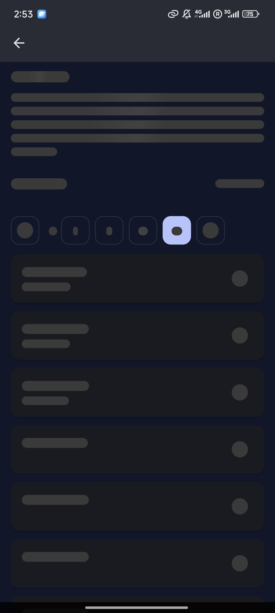

### Loaded

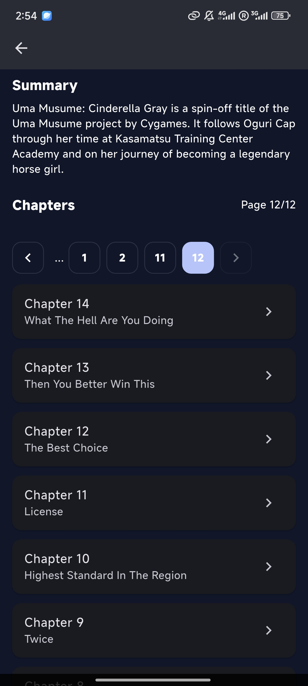

### Reader

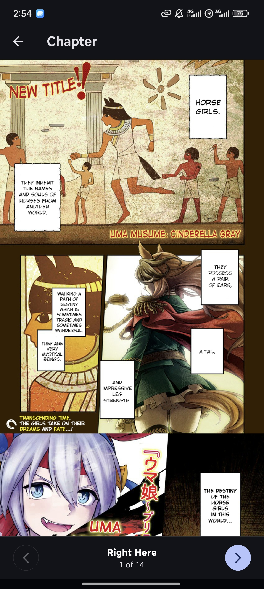

### Reader Scroll


### Zoomable Double Click


### Continue


### Show Where

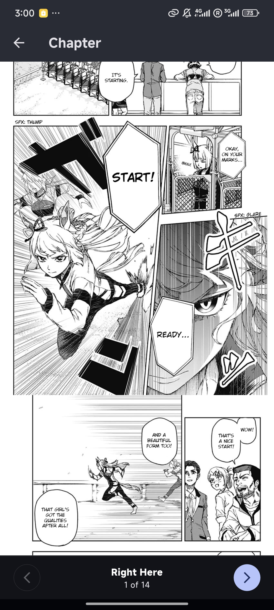

### Add To Favorite

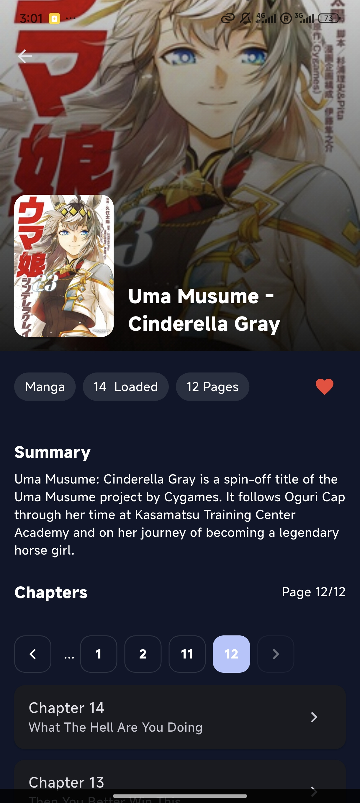

### Favorite

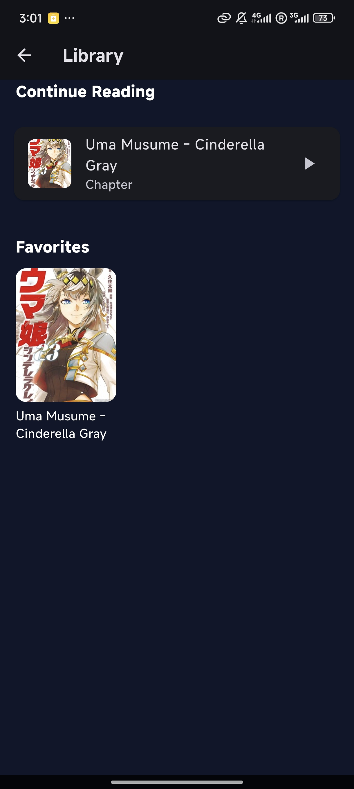

---

## 🚀 Getting Started

### 1. Clone Project

```bash
git clone <your-repo-url>
cd otaku_flow
```

### 2. Install Dependencies

```bash
flutter pub get
```

### 3. Generate Localization

```bash
flutter gen-l10n
```

### 4. Run App

```bash
flutter run
```

---

## 🌐 API Source

This project uses:

- MangaDex API

Base URL:

```text
https://api.mangadex.org
```

---

## 🔥 Key Features Explained

### Continue Reading

Automatically saves:

- Manga title
- Cover image
- Current chapter
- Scroll position
- Page progress

Users can resume instantly from Home.

---

### Favorites

Users can:

- Save manga locally
- Remove favorites
- Build personal library

---

### Reader Experience

Includes:

- Fast image caching
- Premium zoom gestures
- Chapter unavailable fallback flow
- Previous / Next chapter controls

---

## 🌍 Localization

Supported locales:

- en
- vi
- ja
- th

ARB based translation system.

---

## ⚙ Flavors

Supports environment configs:

- DEV
- PROD

With custom launcher icons / splash assets.

---

## 🧪 Testing

Run tests:

```bash
flutter test
```

---

## 📦 Build Release

Android:

```bash
flutter build apk --release
```

iOS:

```bash
flutter build ios --release
```

---

## 📈 Future Ideas

- Offline downloads
- User accounts / sync
- Reading history screen
- Notifications for updates
- Custom reader themes
- Smart recommendations

---

## 🤝 Contributing

Pull requests welcome.

---

## 📄 License

MIT License

---

## 👑 Built With Focus

Designed for fast shipping, clean code, and real user experience.
